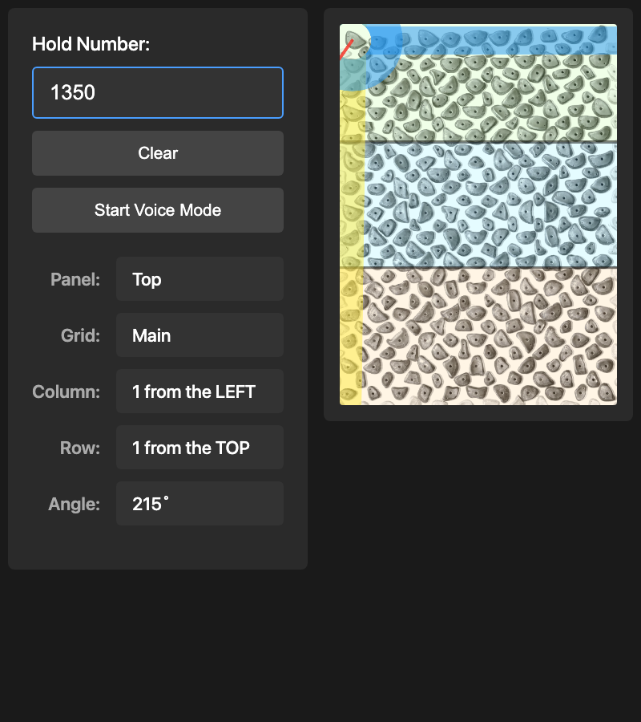
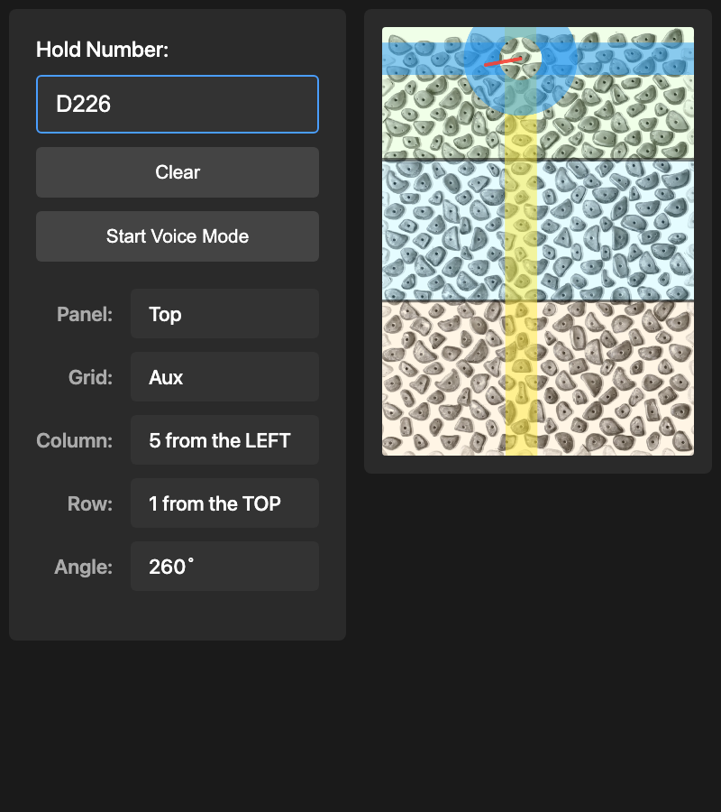

# Kilter Homewall 7x10 Hold Lookup

A web app to help install climbing holds on the Kilter homewall 7x10 configuration. Search for a hold by number and see its exact location on the board.

## Features

- **Hold Search:** Type a hold number to instantly locate it on the wall
- **Visual Highlighting:** Row (blue), column (yellow), and hold position (red) guides
- **Angle Display:** Shows the installation angle for each hold
- **Voice Search:** Speech recognition for hands-free lookup

## Screenshots

| Main Grid Hold | Aux Grid Hold |
|:-:|:-:|
|  |  |

## Getting Started

Serve the directory with any local web server:

```bash
# Python 3
python -m http.server 8000

# Node.js
npx http-server
```

Then open `http://localhost:8000` and type a hold number (e.g., "1143", "D226").

## Data

The project uses two CSV grid configurations:

- **`HW7x10_Main_Line_Grid.csv`** — Odd columns (C-1, C-3, ..., C-21) and odd rows (R-7, R-9, ..., R-35)
- **`HW7x10_Aux_Grid.csv`** — Even columns (C-2, C-4, ..., C-20) and even rows (R-8, R-10, ..., R-34)

Each hold entry includes a hold number, installation angle, and grid position.

## License

MIT
